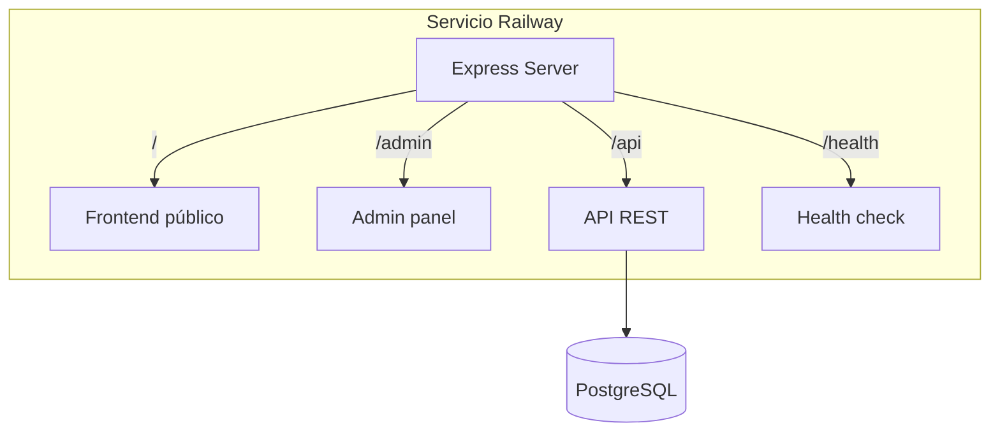

# Plan: Plantilla Railway Todo-en-Uno

## Objetivo

Desplegar frontend público, admin y backend en un único servicio Railway. Una URL por cliente, sin CORS, sin Netlify. Proceso automatizable mediante Railway Templates.

## Arquitectura objetivo




**URLs resultantes por instancia:**

- `https://[proyecto].up.railway.app/` - Tienda de sorteos
- `https://[proyecto].up.railway.app/admin` - Panel administración
- `https://[proyecto].up.railway.app/api` - API
- `https://[proyecto].up.railway.app/health` - Health check

---

## Fase 1: Dockerfile - Incluir build del frontend

**Archivo:** [Dockerfile](Dockerfile)

**Cambios:**

1. Añadir etapa de build del frontend **antes** del backend (el backend necesita `dist/frontend`).
2. Orden: Frontend -> Admin -> Backend.
3. Crear `config.json` con `{"apiUrl":"/api"}` en `deprecated_frontend/public/` antes del build (mismo origen).

**Estructura propuesta:**

```
# 1. Build Frontend
WORKDIR /app/deprecated_frontend
COPY deprecated_frontend/package*.json ./
RUN npm install
COPY deprecated_frontend/ ./
RUN echo '{"apiUrl":"/api"}' > public/config.json
RUN npm run build
RUN mkdir -p ../backend/dist && mv dist ../backend/dist/frontend

# 2. Build Admin (existente)
WORKDIR /app/admin-panel
...

# 3. Build Backend (existente)
WORKDIR /app/backend
...
```

---

## Fase 2: Backend - Servir frontend en raíz

**Archivo:** [backend/src/index.ts](backend/src/index.ts)

**Cambios:**

1. **Eliminar** la ruta `app.get('/', ...)` que devuelve JSON (líneas 37-44). El health check quedará en `/health`.
2. **Añadir** servir archivos estáticos del frontend y catch-all SPA:
  - Después de las rutas `/admin` y antes del error handler.
  - `const frontendPath = path.join(__dirname, 'frontend');`
  - `app.use('/', express.static(frontendPath, { index: false, maxAge: '1y', etag: true }));`
  - Catch-all para SPA: rutas que no sean `/api`, `/admin`, `/health` deben servir `frontend/index.html`.
3. **Orden lógico de rutas:**
  - `/`, `/health` (mantener health check explícito)
  - Rutas API
  - `/admin` (static + catch-all)
  - `/` (frontend static)
  - Catch-all `/`* para SPA (excluyendo `/api`, `/admin`, `/health`)
4. **CORS:** Eliminar hardcodes `naorifas.netlify.app` (líneas 88-89). Mantener `FRONTEND_URL`, `RAILWAY_PUBLIC_DOMAIN` y patrones `*.netlify.app`, `*.railway.app` para compatibilidad si en el futuro se usa frontend externo.

---

## Fase 3: Frontend - API URL y limpieza

**Archivo:** [deprecated_frontend/services/apiService.ts](deprecated_frontend/services/apiService.ts)

**Cambios:**

- `DEFAULT_API`: cambiar de URL hardcodeada a `''` o usar `/api` cuando `window.location.origin` existe. Si falla `config.json` y no hay `VITE_API_URL`, usar `window.location.origin + '/api'` en same-origin (o fallback vacío que resuelva a `/api`).

**Lógica simplificada:** Con `config.json` con `{"apiUrl":"/api"}` en el build, `getBaseUrl()` ya resolverá correctamente a `origin + /api` en el cliente. Solo hay que eliminar el fallback hardcodeado `DEFAULT_API = 'https://paginas-production...'` y usar algo como `/api` si no hay config (porque en el nuevo modelo siempre será same-origin).

**Archivo:** [deprecated_frontend/index.html](deprecated_frontend/index.html)

- Eliminar `preconnect` a `paginas-production.up.railway.app` (línea 16).

---

## Fase 4: Admin - URLs de enlaces

**Archivos:** [admin-panel/src/pages/Dashboard.tsx](admin-panel/src/pages/Dashboard.tsx), [admin-panel/src/pages/Purchases.tsx](admin-panel/src/pages/Purchases.tsx)

**Función `getFrontendBaseUrl()`:** Actualmente usa fallback hardcodeado `https://naorifas.netlify.app` en producción.

**Cambio:** En producción (no localhost), usar `window.location.origin` cuando el frontend está en el mismo dominio. Así los enlaces a comprobantes (`/#comprobante?purchase=...`) y verificación (`/#verify`) funcionarán correctamente.

```typescript
// En producción: mismo origen = frontend en /
if (window.location.hostname !== 'localhost') {
  return window.location.origin;
}
```

---

## Fase 5: Configuración de template Railway

**Variables de entorno requeridas:**


| Variable         | Tipo       | Descripción                                      |
| ---------------- | ---------- | ------------------------------------------------ |
| `DATABASE_URL`   | Referencia | `${{Postgres.DATABASE_URL}}` (Railway reference) |
| `JWT_SECRET`     | Generada   | `${{secret(32)}}` para JWT                       |
| `GEMINI_API_KEY` | Opcional   | Chatbot IA                                       |
| `NODE_ENV`       | Fija       | `production`                                     |


**Pasos para crear el template:**

1. Desplegar el proyecto una vez manualmente en Railway.
2. Añadir PostgreSQL como add-on.
3. Settings → "Generate Template from Project".
4. Configurar variables con `${{secret(32)}}` y referencias a la DB.
5. Guardar en Workspace → Templates.

---

## Fase 6: Documentación

**Crear:** [docs/DEPLOY_TEMPLATE_RAILWAY.md](docs/DEPLOY_TEMPLATE_RAILWAY.md)

Contenido:

- Requisitos previos (cuenta Railway, repo GitHub).
- Pasos para desplegar desde template.
- Variables de entorno y opciones.
- Checklist post-deploy: login admin, configurar SystemSettings (nombre, logo, datos bancarios).
- Primeros pasos (crear rifa, probar compra).

---

## Orden de archivos a modificar


| #   | Archivo                                                                                  | Acción                                                    |
| --- | ---------------------------------------------------------------------------------------- | --------------------------------------------------------- |
| 1   | [Dockerfile](Dockerfile)                                                                 | Añadir build frontend                                     |
| 2   | [backend/src/index.ts](backend/src/index.ts)                                             | Servir frontend, eliminar hardcodes CORS, reordenar rutas |
| 3   | [deprecated_frontend/services/apiService.ts](deprecated_frontend/services/apiService.ts) | Eliminar DEFAULT_API hardcodeado                          |
| 4   | [deprecated_frontend/index.html](deprecated_frontend/index.html)                         | Eliminar preconnect                                       |
| 5   | [admin-panel/src/pages/Dashboard.tsx](admin-panel/src/pages/Dashboard.tsx)               | getFrontendBaseUrl → origin                               |
| 6   | [admin-panel/src/pages/Purchases.tsx](admin-panel/src/pages/Purchases.tsx)               | getFrontendBaseUrl → origin                               |
| 7   | docs/DEPLOY_TEMPLATE_RAILWAY.md                                                          | Nuevo                                                     |


---

## Verificación post-implementación

1. Build local con `docker build -t rifas-test .` y `docker run -p 8080:8080 -e DATABASE_URL=... -e JWT_SECRET=xxx rifas-test`.
2. `http://localhost:8080/` → frontend carga.
3. `http://localhost:8080/admin` → admin carga.
4. `http://localhost:8080/api/raffles` → API responde.
5. `http://localhost:8080/health` → status ok.
6. Comprar boleto → comprobante con enlace correcto.
7. Admin confirmar pago → enlace WhatsApp apunta a la misma URL.

---

## Riesgos y mitigaciones


| Riesgo                         | Mitigación                                                                                                        |
| ------------------------------ | ----------------------------------------------------------------------------------------------------------------- |
| Frontend build falla en Docker | Verificar que `deprecated_frontend` tenga todas las dependencias en `package.json` y que no haya paths absolutos. |
| Rutas conflictivas             | Orden estricto: API primero, admin, luego frontend estático y catch-all.                                          |
| Health check Railway           | Railway usa `/` por defecto; si se cambia a HTML, configurar health check path a `/health` en Railway.            |
| Config.json en build           | Crear en Dockerfile antes de `npm run build` para que se copie a `dist`.                                          |


